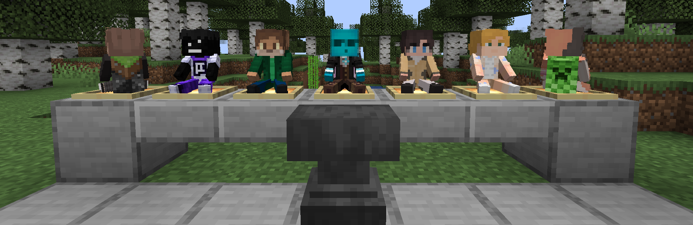
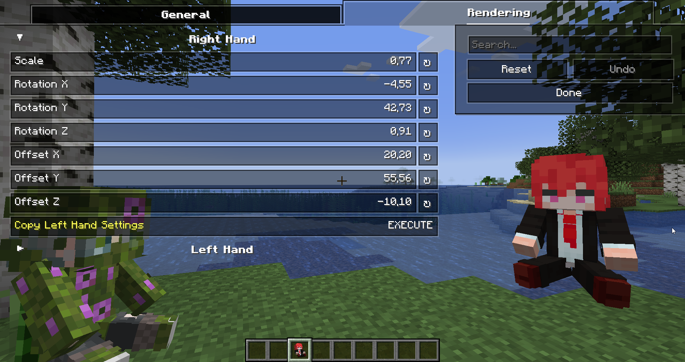
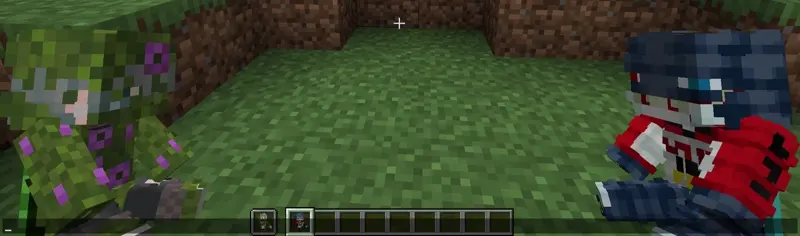
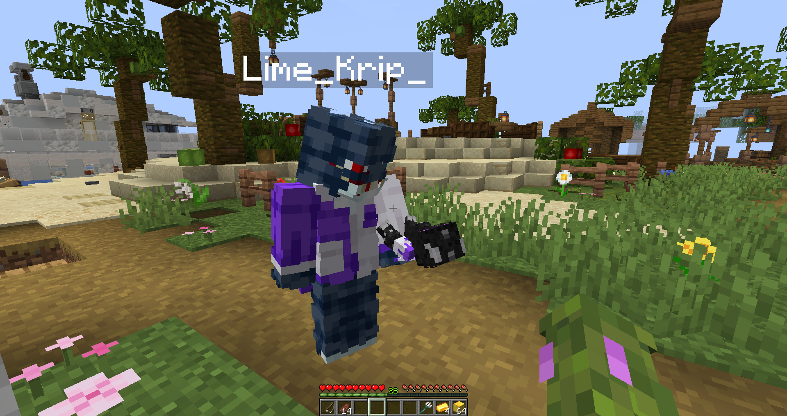

    *curseforge soon*

# My Totem Doll
### Description

My Totem Doll — Simple Client-Side Fabric mod which replaces all totems with player dolls. You can rename your totem to player's nickname to use it's skin. Also supports capes!

## Configuration

You can configure the rendering of totems in first person. Open My Totem Doll configuration screen from Mod Menu and go to the `Rendering` tab, there you will find options for configruing the left and right hand:

## Refresh Player Skins

My Totem Doll also has some commands for refreshing the totem skins:

`/my-totem-doll refresh all` - To refresh skins for all loaded players.

`/my-totem-doll refresh player [<NICKNAME>]` - To refresh skin for specific player.

## Multiplayer Support

You can also see other players' totems! **Without mod on the server.**

## FAQ
1) *Does the mod just download the skin from NameMC?*
- Nope, mod downloads last skin using Mojang API, not from NameMC.
2) *Can I upload this mode somewhere?*
- Nope, only mod authors can upload this mod on other sites.
