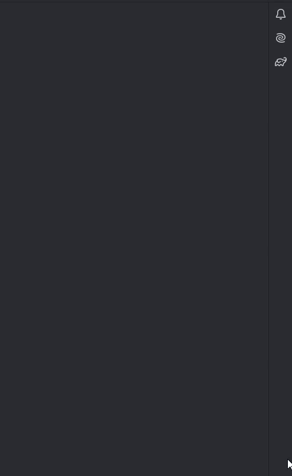
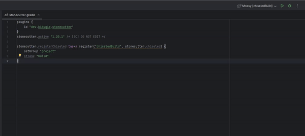
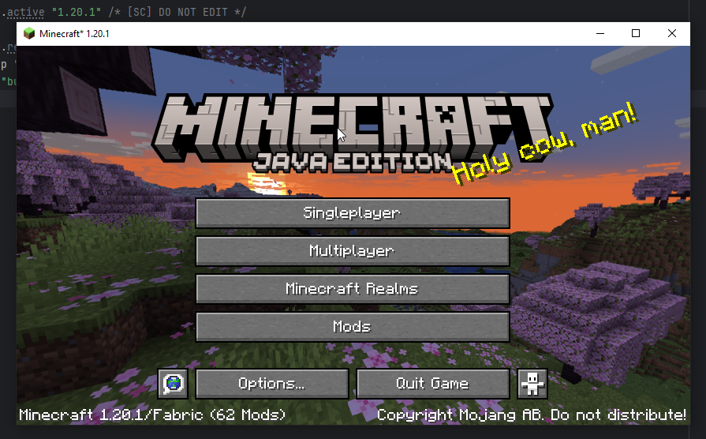
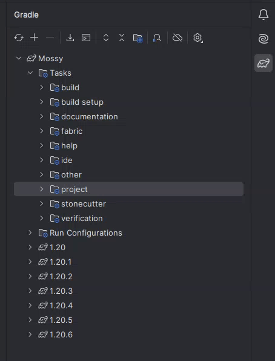
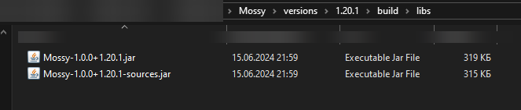

### Mossy - Template Fabric Mod

---

Mossy is a template Fabric mod with some additional tweaks and code templates.

### Tweaks and templates
---
### Done
1) Multi-version modding by [Stonecutter](https://stonecutter.kikugie.dev/) plugin
2) Easy player setting (uuid and nickname)
3) Mod Menu Integration
4) Fast YACL configuration for config screen (WIP)
5) Mod Config template
6) Versioned AWs and Mixins
7) Fast `gradle.properties`, AWs and mixins generation for each version (for 1st point)
8) Split run folder for `runs/client` and `runs/server`
### Planned
9) Add support for multi-loaders

# How to set up it
Basically, there are two ways: 
1) You can fork this template mod and make your mod
2) You can integrate Mossy build system into your ready-made mod

But we will focus on the second way. In this way you will need to copy files `stonecutter.gradle`, `settings.gradle`, `gradle.properties`, `build.gradle`, `LICENSE`, `Mossy/src/main/resources/fabric.mod.json` and optional `.gitignore`. 

Then you will need to set up `gradle.properties`.

## About `gradle.properties`
- `Mod Properties` contains mod info
- `Main Dependencies` like `Build Dependencies`, but not versioned
- `Build Dependencies` contains build properties, usually they versioned
- `Multi-Versions` basically contains only one property, it's a `multi_versions`, versions in it should be separated with space ' '
- `Additional Dependencies` contains additional depends, and you can add it easily:
```properties
# If you want to have it versioned, just write:
dep.MOD_ID=[VERSIONED]
# and add this property to every `Mossy/versions/[MINECRAFT VERSION]/gradle.properties`, if it's boring for you, just remove `gradle.properties` and reload gradle, each `gradle.properties` with last versions of depends will be generated.
#
# If you want to have static version, just write:
dep.MOD_ID=MOD_VERSION
#
# READ ME
# MOD_ID should be taken from Modrinth.
# `dep.` part is important.
```

After you can reload gradle and check all updates.

Also don't forgot to add your dependency in `build.gradle` with this value

## About Mixins and AWs

After reloading gradle, in your `resources` folder you will find `mixins` and `aws` folders. In them, you will find generated mixins and AWs for each minecraft version. What version they are for is indicated in their name.

You might be surprised that all mixins have a `.json5` extension instead of `.json`. This is needed to support comments which are needed for the [Stonecutter](https://stonecutter.kikugie.dev/) plugin. In build all mixins will be converted to `.json` by [j52j](https://github.com/kikugie/j52j).

To understand how comments work, I recommend to check the [Stonecutter docs](https://stonecutter.kikugie.dev/stonecutter/introduction).

AWs, in turn, have nothing unusual.

## About `fabric.mod.json`
In Mossy, `fabric.mod.json` has some features you should know, here are the main ones:
```json5
// ...
// Other code
    "depends": {
        "fabricloader": ">=${fabric_loader}",
        "minecraft": ">=${minecraft}",
        "java": ">=${java}",
        "fabric-api": ">=${fabric_api}"
    }, // needs because we have multi-versions
    "accessWidener": "aws/${minecraft}.accesswidener", // needs to get path to AW for current minecraft version
    "mixins": [
        "mixins/${minecraft}-${modId}.mixins.json" // needs to get path to mixing config for current minecraft version
    ]
// Other code
// ...
```

## About `player/player.properties`

`Mossy/player/player.properties` is just a properties file, which uses to set up minecraft runs config with properties, to set up your nickname and uuid if they are present. If you want to add it, just create `player` folder in your project, and file `player.properties` with this content:

```properties
# Player properties
# If you don't want to change any properties, just remove it
player_nickname=Cool boy
player_uuid=Your UUID here
# After changes, you need to delete "/.idea/runConfigurations" folder and reopen project and reload gradle
```

## About `.json5` files
At now plugin j52j will convert all `.json5` files in `Mossy/src/main/resources/` to `.json` in build, check [this](https://github.com/kikugie/j52j?tab=readme-ov-file#configuring-the-plugin) if you wanna to safe some files from converting.

# How to use it

## Switching current minecraft version

After settings and reloading gradle, you should have gradle tasks in the `stonecutter` category, select the one and you will switch the active minecraft version of the game to the selected one.
- `Refresh active project` will refresh project and update comments.
- `Reset active project` will switch current minecraft version to first of the `multi_versions` in main `gradle.properties` file.

You can check current minecraft version in `stonecutter.gradle` file.
For more info check the [Stonecutter docs](https://stonecutter.kikugie.dev/stonecutter/introduction).

<details>
<summary>Showcase</summary>
<br>

</details>

## Launching current minecraft version
To run current minecraft version with your mod you will need to execute run configuration with the same version, that in `stonecutter.gradle`, to switch it, read previous text above.

Also, your game folder is now split to `Mossy/runs/client` and `Mossy/runs/server`, boop.

<details>
<summary>Showcase</summary>
<br>


</details>

## Building mod
To build your mod for each minecraft version which you write in main `gradle.properties`, you can just start specified gradle task `chiseledBuild` in `project` group, after execution you can go to `Mossy/versions/[MINECRAFT VERSION]/build/libs/your_builded_mod.jar`.

<details>
<summary>Showcase</summary>
<br>


And after executing `chiseledBuild` task you can check your mods, here is example for minecraft 1.20.1:


</details>
