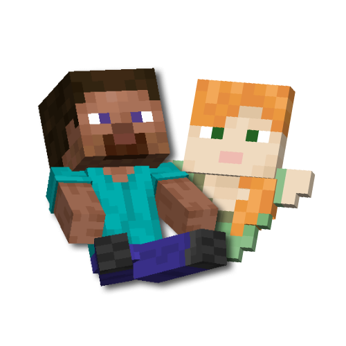

   

## Description

My Totem Doll — Client-Side Fabric Mod which replaces all totems with player dolls. **Rename your totem to player's nickname to use it's skin.** Also supports capes!

## Welcome Screen

When you launch game with mod for the first time, you will be greeted with a Welcome Screen. Here you will select your default totem:

## Configuration
### Rendering
You can configure the rendering of totems in the first person. Open My Totem Doll configuration screen from Mod Menu and go to the `Rendering` tab, there you will find options for configuring the left and right hand:

### Standard Doll
You can also customize the hands, model, skin textures for your standard totem!

## Refresh Player Skins

My Totem Doll also has some commands for refreshing the totem skins:

`/my-totem-doll refresh all` - To refresh skins for all loaded players.

`/my-totem-doll refresh player [<NICKNAME>]` - To refresh skin for specific player.

## Totem Customization

You can customize individual totems in the anvil! **Put your totem in the anvil to the first slot to see the Tags menu button. Click on it to open the Tags menu.**

## Multiplayer Support

You can also see other players' totems! **Without mod on the server.**

## FAQ
*Does the mod just download the skin from NameMC?*

- Nope, mod downloads last skin using Mojang API, not from NameMC.
